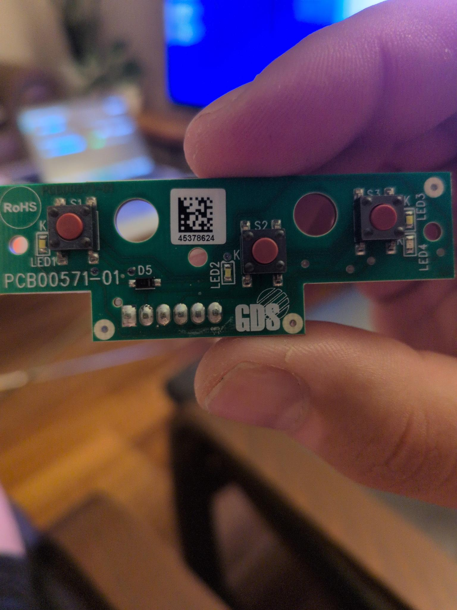
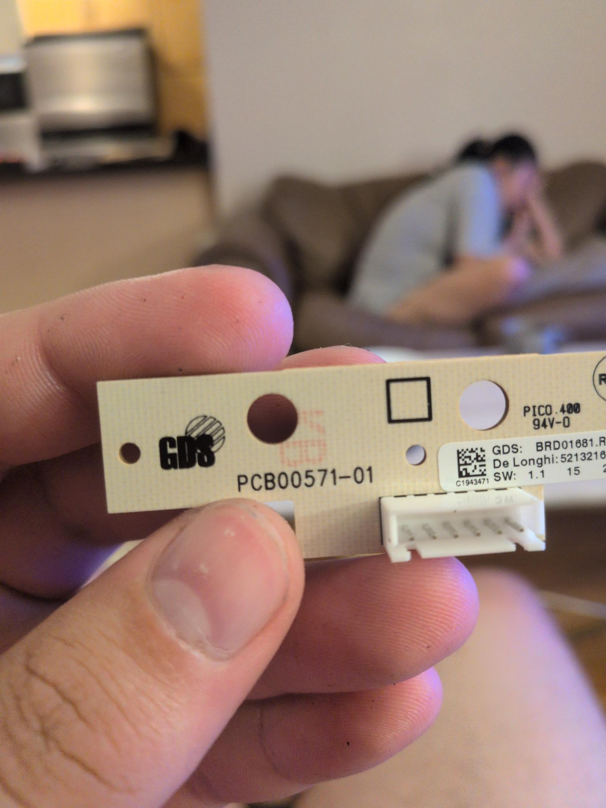

# esphome-dedica-ec

An ESPHome package that tracks the live state of a **De'Longhi Dedica EC-series**
espresso machine (EC680 / EC685 / EC885 family) — and can trigger its buttons — and
exposes all of it to **Home Assistant**. Non-invasive: the machine keeps working
normally while connected.

It surfaces the machine's real state — powered, heating, ready, which mode, and button
presses — as standard Home Assistant entities you can build any automation on, plus
buttons you can press from Home Assistant. What you do with those entities is up to you.

The button/LED board (GDS **PCB00571-01**) carries 3 buttons and 4 LEDs on a 6-wire
connector, driven by the main board as a **~500 Hz two-phase common-anode multiplexed
matrix**. This package reconstructs that scan on an ESP32 and reports decoded state.

---

## AI Disclosure

The wiring and the idea are all mine, LLM (Claude Opus 5) was used to help decode the protocol and what each wire did.

## Entities exposed to Home Assistant

| Entity | Type | Meaning |
|---|---|---|
| **Steam Ready** | binary_sensor | white steam LED solid → steam at temperature |
| **Steam Heating** | binary_sensor | steam mode, white LED still flashing |
| **Coffee Ready** | binary_sensor | cup LEDs solid → brew temperature reached |
| **Machine On** | binary_sensor | the panel is powered |
| **Steam Mode / Coffee Mode** | binary_sensor | which mode the machine is in |
| **Button Pressed** | binary_sensor | a key is being physically held |
| **2-Cup Pressed / Steam Pressed** | binary_sensor | which key (see notes) |
| **Press 1-Cup / 2-Cup / Steam** | button | *simulate* a press — needs optocouplers |

---

## Hardware

- An **ESP32** dev board (`esp32dev` — e.g. ELEGOO ESP32-WROOM-32).
- **5 × 10 kΩ resistors** — one in series per signal line (**required**, see below).
- Wire to tap the button board's 6-pin connector.
- *For button control (optional):* **3 × PC817** optocouplers and **3 × 470 Ω** resistors.

> ⚠️ **The 10 kΩ series resistors are not optional.** Connected directly, the ESP32's
> input clamp diodes load the matrix's tri-stated sense lines and the machine misbehaves
> (for example, pressing 1-cup blanks every LED). A 10 kΩ resistor in each line decouples
> the ESP32 so the machine behaves normally.

---

## Wiring

The input lines **must** land on the specific pins below — the decoder reads the ESP32's
`GPIO_IN1` register directly, so GPIO32/34/35/36/39 are fixed. Wire each of the five
signal lines from the button board's 6-pin connector through **its own 10 kΩ resistor**
to the listed ESP32 pin, and connect the connector's ground pin **directly** (no resistor)
to an ESP32 ground pin. Power the ESP32 from USB or a 5 V supply.

| Connector line | Role on this board | ESP32 pin | Series resistor |
|---|---|---|---|
| E | LED-scan line | GPIO32 | 10 kΩ |
| C | LED-scan line (encodes coffee vs steam) | GPIO34 | 10 kΩ |
| D | LED-scan line | GPIO35 | 10 kΩ |
| A | button-sense (idles low) | GPIO36 (VP) | 10 kΩ |
| B | anode / gate | GPIO39 (VN) | 10 kΩ |
| GND | ground / common | any GND pin | none |

Connector-pin *order* can vary between machines. Identify which physical wire is which
by flashing the diagnostic config and watching the pins respond as you operate the
machine:

```bash
esphome run esphome/reader.yaml
esphome logs esphome/reader.yaml
```

Map your wires so that E, C, D, A and B end up on the pins listed above. The board photos
in `images/` show the connector, buttons (S1, S2, S3) and LEDs for reference:





### Optional: button control (optocouplers)

Each button is a switch that shorts its line to ground. To press one from Home Assistant,
drive an optocoupler across that switch's two pads. For each button: connect the ESP32
output pin through a **470 Ω** resistor to the **anode** of a PC817's LED, connect the
LED **cathode** to ground, and wire the PC817's **output transistor across the two pads**
of the corresponding switch on the button board.

| Switch | Function | ESP32 output pin |
|---|---|---|
| S1 | 1-cup | GPIO25 |
| S2 | 2-cup | GPIO26 |
| S3 | steam | GPIO27 |

Pressing the matching Home Assistant button pulses the optocoupler for 150 ms, which the
machine reads as one keypress, fully isolated. **Do not** try to press by driving the
read-taps — that fights the machine driving the same line (bus contention). The output
pins are remappable via the `pin_opto_1cup` / `pin_opto_2cup` / `pin_opto_steam`
substitutions.

---

## Install (ESPHome package)

Pull the decoder straight from GitHub and add your own network config. Create a config
like this (a copy is in `esphome/example.yaml`), replacing `YOUR_GH_USERNAME`:

```yaml
substitutions:
  name: dedica
  friendly_name: Dedica

packages:
  dedica-ec: github://YOUR_GH_USERNAME/esphome-dedica-ec/esphome/dedica-ec.yaml@v1.0.0

wifi:
  ssid: !secret wifi_ssid
  password: !secret wifi_password

api:
  encryption:
    key: !secret api_key

ota:
  - platform: esphome
    password: !secret ota_password
```

Then:

```bash
cd esphome
cp secrets.yaml.example secrets.yaml     # then fill it in
#   api_key:  openssl rand -base64 32
esphome run example.yaml
```

The device appears in Home Assistant via the native API — adopt it and the entities
above show up.

### Using the entities

Every entity is a standard Home Assistant `binary_sensor` or `button`, so you can trigger
any automation on their state. For example, on the rising edge of **Steam Ready**:

```yaml
automation:
  - alias: "Dedica steam ready"
    trigger:
      - platform: state
        entity_id: binary_sensor.dedica_steam_ready
        to: "on"
    action:
      # ... any action you like
```

---

## Terminal test (no Wi-Fi)

To verify wiring and decoding over USB before involving Home Assistant:

```bash
esphome run esphome/test.yaml        # flash + open serial logs
```

Operate the machine and watch a status line print once per second:

```
[dedica] ON=1 | coffee[mode=1 ready=0] | steam[mode=0 ready=0] | btn=0 2cup=0 steam=0
```

---

## Files

| Path | Purpose |
|---|---|
| `esphome/dedica-ec.yaml` | the shareable package (pins, decoder, sensors, button outputs) |
| `esphome/example.yaml` | production config — the package plus your wifi/api/ota |
| `esphome/test.yaml` | terminal test — decoded state to serial, no Wi-Fi |
| `esphome/reader.yaml` | diagnostic: high-rate burst capture for identifying pins |
| `esphome/secrets.yaml.example` | template for your credentials |
| `images/` | button-board photos |

---

## Notes & limits

- **1-cup detection:** the 1-cup button shorts line E to ground (it does *not* trip the
  A sense line), so it reads as an LED blank rather than a distinct press. 2-cup and steam
  presses are detected.
- **Button control needs the optocouplers** — without them the Press-* buttons exist but
  do nothing.
- **Power:** keep the ESP32 on a stable supply; the steam heater's switching transient can
  brown it out through the shared ground. A 470 µF capacitor across the ESP32's 5 V helps.

## Safety

The Dedica is mains-powered. Only ever tap the **low-voltage** button/LED board — never
the heater, pump or triac side. ESP32 GPIO are 3.3 V maximum; measure any unfamiliar line
before connecting.

## How it works

The panel is a ~500 Hz two-phase common-anode multiplexed matrix. Mode is encoded by
line **C** during the `E`+`B` scan phase (low = coffee, high = steam); "ready" is that
marker held solid rather than flashing (flashing is the anode **B** being gated on/off);
and a button press raises the **A** sense line (`0x99` = 2-cup, `0x95` = steam). The
decoder samples the lines at 500 kHz for ~6 ms every 150 ms and classifies the result.

## License

Licensed under either of **MIT** (`LICENSE-MIT`) or **Apache-2.0** (`LICENSE-APACHE`) at
your option.
